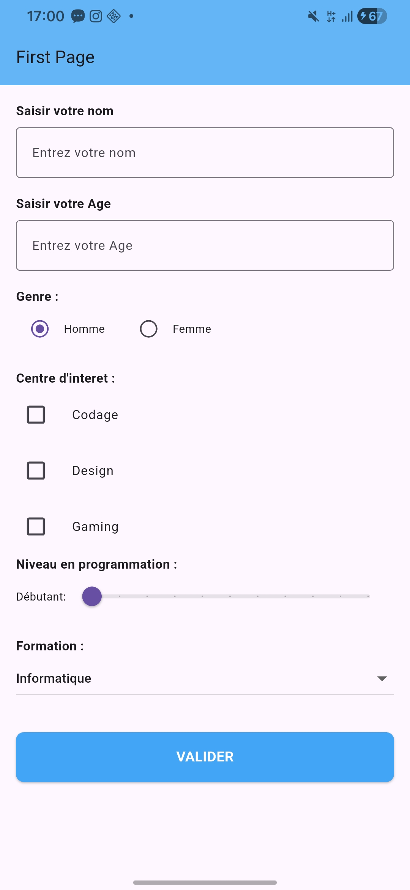

# Formulaire de Profil - App Flutter

## 📱 Description du Projet
Ce mini-projet est une interface utilisateur (UI) moderne et intuitive conçue avec **Flutter**. L'application propose un formulaire de création de profil permettant la collecte d'informations personnelles à l'aide des widgets natifs de Flutter. Elle représente une base excellente pour apprendre la gestion d'état locale (`StatefulWidget`) et les composants de formulaire sous Flutter.

### 🎯 Fonctionnalités Principales :
- **Saisie de texte :** Champ de texte basique pour le *Nom*.
- **Clavier numérique :** Champ adapté pour renseigner l'*Âge*.
- **Boutons Radio :** Sélection mutuellement exclusive pour le *Genre* (Homme / Femme).
- **Cases à cocher (Checkboxes) :** Sélection multiple pour les *Centres d'intérêt* (Codage, Design, Gaming).
- **Slider interactif :** Curseur glissant pour évaluer le *Niveau en programmation* (de 0 à 100).
- **Menu déroulant (Dropdown) :** Liste pour le choix de la *Formation*.

## 📸 Aperçu (Screenshot)
Voici un aperçu visuel du rendu de l'interface :

## 🛠️ Technologies
- **Framework :** Flutter (Material Design 3)
- **Langage :** Dart

## 🚀 Utilisation
Étant donné que ce dossier contient uniquement le fichier source principal et son rendu visuel :
1. Créez un nouveau projet Flutter vide (`flutter create nom_du_projet`).
2. Remplacez le contenu du fichier `lib/main.dart` par celui fourni ici.
3. Lancez votre émulateur ou connectez votre appareil.
4. Exécutez la commande `flutter run`.

---
*Ce projet a été structuré avec soin pour offrir un code clair, documenté et prêt à l'emploi. N'hésitez pas à le cloner et à le modifier !*
